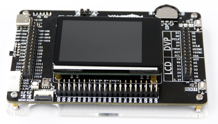

# opensource toolchain for Kendryte K210

The Kendryte K210 is a system-on-chip (SoC) that integrates machine vision and machine hearing. Using TSMC's ultra-low-power 28nm advanced process with dual-core 64-bit processors for better power, performance, stability and reliability. The program strives for zero threshold development and can be deployed in the user's products in the shortest time, giving the product artificial intelligence.

The Kendryte K210 is located in the SoC of the AI and IoT markets and is a very convenient MCU.

In Chinese, Kendryte means surveying intelligence, while surveying intelligence is taken from surveying and searching. The main application field of this chip is in the field of Internet of Things, and it is developed in the field of Internet of Things. Therefore, this chip mainly provides artificial intelligence solutions, which are explored in the field.

- Machine vision
- Machine hearing
- Better low power vision processing speed and accuracy
- With convolutional artificial neural network hardware accelerator KPU, high performance convolution artificial neural network operation
- TSMC 28nm advanced process, temperature range -40 ° C to 125 ° C, stable and reliable
- Supports firmware encryption, it is difficult to crack using common methods
- Unique programmable IO array for more flexible product design
- Low voltage, lower power consumption compared to systems with the same processing power
- 3.3V/1.8V dual voltage support, no level shifting, cost saving

In short, Kendryte K210 is **RISC-V Dual Core 64bit MCU with FPU**.


# Hardware prerequiest
- A Kendryte K210 devboard
  + I use [Yahboom K210-Developer-Kit](https://www.yahboom.com/study/K210-Developer-Kit) in this tutorial.
  + Sipeed also produce a series K210 devboards.
- Any JTAG Debugger



# Toolchain overview
- Compiler : RISC-V 64bit GNU toolchain with '--with-abi=lp64f --with-arch=rv64imafc'
- SDK : [kendryte-standalone-sdk](https://github.com/kendryte/kendryte-standalone-sdk)
- Programming : [kflash.py](https://github.com/kendryte/kflash.py)
- Debugging : Kendryte OpenOCD / gdb

# Compilers

Kendryte K210 is 64bit RISC-V MCU with single-precision floating point instructions, It's hard to find a general prebuilt RISC-V toolchain (such as XPack) which can support it directly. We have to build it from source or use Kendryte pre-built toolchain.

# Option 1 : Kendryte pre-built toolchain

The Kendryte pre-built toolchain can be downloaded from : https://github.com/kendryte/kendryte-gnu-toolchain. It provide:
- Binutils 2.31.51
- GDB 8.2
- GCC 8.2.0

A little bit outdated but still works.

Download and extract it as:
```
wget https://github.com/kendryte/kendryte-gnu-toolchain/releases/download/v8.2.0-20190213/kendryte-toolchain-ubuntu-amd64-8.2.0-20190213.tar.gz
sudo tar xf kendryte-toolchain-ubuntu-amd64-8.2.0-20190213.tar.gz -C /opt
```

The toolchain will located at '/opt/kendryte-toolchain'.

**NOTE :**, do NOT add '/opt/kendryte-toolchain/bin' to PATH env, since we will invoke it later by set TOOLCHAIN options in SDK. the triplet of Kendryte RISC-V toolchain is **riscv64-unknown-elf**, it may be conflict with other RISC-V toolchains, so do NOT add it to PATH env.

The prebuilt toolchain was released serveral years ago, it may requires some libraries with specific version your OS may not provided, such as 'libisl.so.19'. These libraries already put to '/opt/kendryte-toolchain/bin' dir officially. We have 2 way to tell commands to find these libraries. the triditional way is set `LD_LIBRARY_PATH` point to '/opt/kendryte-toolchain/bin', but it is not convenient for a toolchain. Here we use `patchelf` to set rpath of binraries. After toolchain extracted:

```
cd /opt/kendryte-toolchain/libexec/gcc/riscv64-unknown-elf/8.2.0
sudo patchelf --set-rpath /opt/kendryte-toolchain/bin cc1
sudo patchelf --set-rpath /opt/kendryte-toolchain/bin cc1plus
sudo patchelf --set-rpath /opt/kendryte-toolchain/bin lto1
```

# Option 2 : build toolchain from sources

Please refer to https://github.com/kendryte/kendryte-gnu-toolchain to build the toolchain yourself.


# SDK

The upstream K210 SDK is https://github.com/kendryte/kendryte-standalone-sdk, just clone it and put it somewhere, for example HOME dir.

```
git clone https://github.com/kendryte/kendryte-standalone-sdk.git
```

The sdk is organized by cmake and very easy to use, to start a project, it just need create a dir under 'src' and put your codes there.

Use 'main.c' in this repo as example, it will blink one LED connect to IO 17 on yahboom K210 devboard (you may need to change it to match your devboard):

```
cd kendryte-standalone-sdk
mkdir src/blink
cp <path>/main.c src/blink
mkdir build
cd build
cmake .. -DPROJ=blink -DTOOLCHAIN=/opt/kendryte-toolchain/bin
make
```
Here are some options need explained:
`-DPROJ=blink` : which project you want to build, 'blink' is the dir name we just created under 'src' dir.
`-DTOOLCHAIN=/opt/kendryte-toolchain/bin` : where to find the toolchain.

Using `make -jN` (N should be the number of processors of your computer) to accelerate the building process
Using `make VERBOSE=1` to get verbose output of make.

After built successfully, 'blink' and 'blink.bin' will be generated at 'build' dir. 'blink' is a ELF file useful for debugging, 'blink.bin' is the firmware we will program to target device later.

# Programming

Programming K210 is also very easy, most of K210 devboards has a UART chip (such as CH34x) integrated on board. After plug the devboard to PC USB port, a serial device such as '/dev/ttyUSB0' or '/dev/ttyACM0' will be created. This is the serial device we will use when programming.

The official programming tool is [kflash.py](https://github.com/kendryte/kflash.py), just clone the repo and put 'kflash.py' to PATH:

```
git clone https://github.com/kendryte/kflash.py
sudo cp kflash.py /usr/bin/kflash
sudo chmod +x /usr/bin/kflash
```

Use above 'blink' demo as example, program it to yahboom k210 devboard as:
```
kflash -p /dev/ttyUSB0 -b 2000000 blink.bin
```
The `-p /dev/ttyUSB0` can be ommited. `-b 2000000` to set a high baudrate will improve the speed of programming.

After programming finished, you will find the 2 LEDs on board blinked.

# Debugging

Kendryte K210 support JTAG debugging, But requires a forked RISC-V OpenOCD.

> Because the debug protocol used by K210 is RISC-V External Debug Support Version 0.11, and the official openocd does not
> support multi-core debugging for this version. So Kendryte made a lot of changes, so that Kendryte OpenOCD can be used for
> debugging kendryte chips as much as possible.

## Build kendryte OpenOCD:

```
git clone https://github.com/kendryte/openocd-kendryte.git
cd openocd-kendryte
./bootstrap
./configure --prefix=/usr \
  --datadir=/usr/share/kendryte-openocd \
  --disable-werror \
  --program-prefix=kendryte-
make
sudo make install
```
These configurations use `kendryte-` prefix to avoid conflict with original OpenOCD installed in your system, the OpenOCD command for kendryte is `kendryte-openocd`.


## The JTAG pinout of K210

| IO Pin | JTAG |
|--------|------|
| IO 0   | TCK  |
| IO 1   | TDI  |
| IO 2   | TMS  |
| IO 3   | TDO  |

**NOTE 1 :** you should avoid to re-map these IO pins if you want to debug by jtag, otherwise it require a reset to enter JTAG debugging mode, and even JTAG debugging activated, after these IO pins remapped in your codes, it is impossible to continue debugging.

**NOTE 2 :** Yahboom K210 Developer Kit did not export RST pin (it's stupid), but some Sipeed K210 devboards exported. with RST pin, it is easy to enter JTAG mode even IO 0 - IO 3 were remapped, but remember that, if your codes use these pins, it is still impossible to continue the jtag debugging.

I wrote a script only works with Yahboom K210 Developer Kit, to demo how to activate JTAG debugging mode even IO 0-3 remapped

- Use 'main-remap-io0.c', it will blink the LED connect to IO 0, build and flash it to Yahboom K210 devboard.
- Since the IO 0 remapped, when codes running, you coule never be able to activate JTAG debugging mode, openocd always fail.
- using the typec port to supply power and it will also create a serial device (we used for UART ISP programming above). DTR of this serial device can be used to reset the devboard. mainwhile keep JTAG adapter plugged in. 
- run 'python yahboom-k210-always-enter-jtag.py /dev/ttyUSBx', it will reset the board, wait a little while and activate JTAG debugging mode.
- But if continue run the demo codes, the OpenOCD will report an ERROR since IO 0 was re-mapped eventually. 

## Launch Kendryte OpenOCD
Here I use sipeed ft2232d jtag debugger, wire it up and using the `target-k210.cfg` config file in this repo, launch kendryte openocd as:
```
kendryte-openocd -f interface-ft2232d.cfg -f target-k210.cfg
```
If you use other JTAG adapter, such as JLink, etc, you should find corresponding openocd interface config file for it.

The output looks like:
```
 _  __              _            _
| |/ /___ _ __   __| |_ __ _   _| |_ ___
| ' // _ \ '_ \ / _` | '__| | | | __/ _ \
| . \  __/ | | | (_| | |  | |_| | ||  __/
|_|\_\___|_| |_|\__,_|_|   \__, |\__\___|
                           |___/
Kendryte Open On-Chip Debugger For RISC-V v0.2.3 (2019-02-21)
Licensed under GNU GPL v2
adapter speed: 10000 kHz
Info : ftdi: if you experience problems at higher adapter clocks, try the command "ftdi_tdo_sample_edge falling"
Info : clock speed 10000 kHz
Info : JTAG tap: riscv.cpu tap/device found: 0x04e4796b (mfg: 0x4b5 (<unknown>), part: 0x4e47, ver: 0x0)
Core [0] halted at 0x800018b8 due to debug interrupt
Info : Examined RISCV core; found 2 harts
Info : Listening on port 3333 for gdb connections
Core [1] halted at 0x80000c24 due to debug interrupt
Core [0] halted at 0x800018b4 due to debug interrupt
Info : Listening on port 6666 for tcl connections
Info : Listening on port 4444 for telnet connections
```

## Debugging with gdb
As mentioned above, when I install the toolchain, the toolchain path is not added to PATH env, here should use abosolute path to invoke `riscv64-unknown-elf-gdb`:

```
cd kendryte-standalone-sdk/build
/opt/kendryte-toolchain/riscv64-unknown-elf-gdb ./blink
```
After the '(gdb)' prompt show:
```
gdb) target remote :3333
Remote debugging using :3333
warning: Target-supplied registers are not supported by the current architecture
usleep (usec=1000000) at /home/cjacker/yab/kendryte-standalone-sdk/lib/bsp/sleep.c:24
24              if(read_cycle() - cycle >= nop_all)
(gdb) load
Loading section .text, size 0xc9030 lma 0x80000000
....
(gdb) b main
Breakpoint 1 at 0x800002ca: file xxx/kendryte-standalone-sdk/src/blink/main.c, line 35.
(gdb) c
Continuing.

Breakpoint 1, main () at .....
35          hardware_init(); 
(gdb)
```
